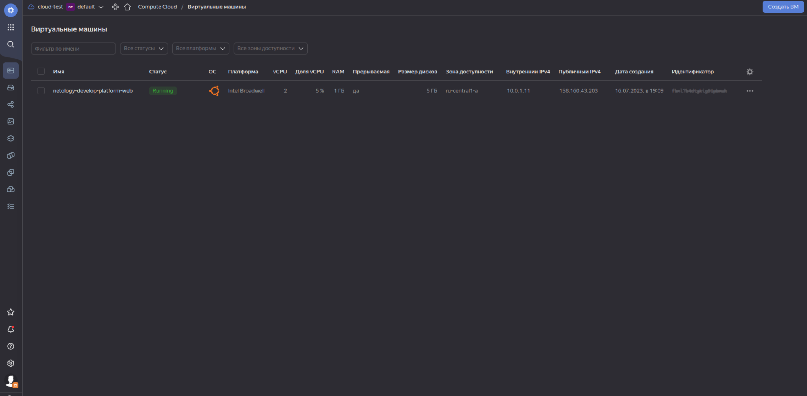
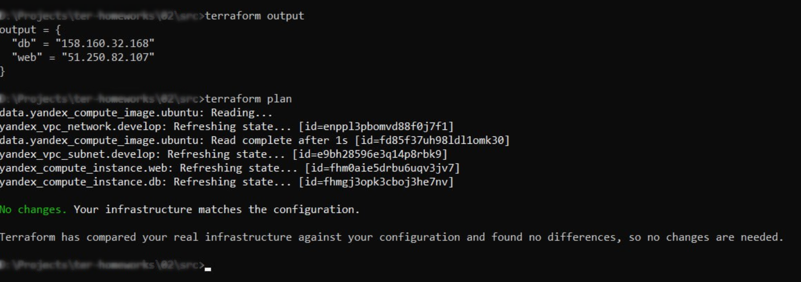

## Домашнее задание к занятию «Основы Terraform. Yandex Cloud»

### Задание 1

1. Изучите проект. В файле variables.tf объявлены переменные для yandex provider.
2. Переименуйте файл personal.auto.tfvars_example в personal.auto.tfvars. Заполните переменные (идентификаторы облака, токен доступа). Благодаря .gitignore этот файл не попадет в публичный репозиторий. Вы можете выбрать иной способ безопасно передать секретные данные в terraform.
3. Сгенерируйте или используйте свой текущий ssh ключ. Запишите его открытую часть в переменную vms_ssh_root_key.
4. Инициализируйте проект, выполните код. Исправьте намеренно допущенные синтаксические ошибки. Ищите внимательно, посимвольно. Ответьте в чем заключается их суть?
5. Ответьте, как в процессе обучения могут пригодиться параметрыpreemptible = true и core_fraction=5 в параметрах ВМ? Ответ в документации Yandex cloud.
В качестве решения приложите:

скриншот ЛК Yandex Cloud с созданной ВМ,
скриншот успешного подключения к консоли ВМ через ssh(к OS ubuntu необходимо подключаться под пользователем ubuntu: "ssh ubuntu@vm_ip_address"),
ответы на вопросы.

Ответ:
4. Суть допущенных ошибок заключается в том, чтобы мы поняли, что при неправильном указании параметров для инициализации ресурса этот ресурс не сможет быть создан, а при их исправлении и перезапуске команды terraform apply те ресурсы, которые уже были созданы, не будут пересоздаваться.  

5. Параметр ```preemptible = true``` отвечает за то, что создаваемая ВМ будет прерываемой, то есть её можно будет остановить или удалить в любой момент

    Параметр ```core_fraction=5``` отвечает за уровень производительности vCPU. Виртуальные машины с уровнем производительности меньше 100% имеют доступ к вычислительной мощности физических ядер как минимум на протяжении указанного процента от единицы времени.


### Вложения:

<details>
<summary> Скриншоты </summary>




</details>

### Задание 2

1. Изучите файлы проекта.
2. Замените все "хардкод" значения для ресурсов yandex_compute_image и yandex_compute_instance на отдельные переменные. К названиям переменных ВМ добавьте в начало префикс vm_web_ . Пример: vm_web_name.
3. Объявите нужные переменные в файле variables.tf, обязательно указывайте тип переменной. Заполните их default прежними значениями из main.tf.
4. Проверьте terraform plan (изменений быть не должно).

Решение:[variables.tf](https://github.com/basson63/devops-netology-29/tree/main/Terraform/terr/variables.tf)


После изменения "хардкод значений" в terraform plan никаких изменений не появилось:


### Задание 3 

1. Создайте в корне проекта файл 'vms_platform.tf' . Перенесите в него все переменные первой ВМ.
2. Скопируйте блок ресурса и создайте с его помощью вторую ВМ(в файле main.tf): "netology-develop-platform-db" , cores = 2, memory = 2, core_fraction = 20. Объявите ее переменные с префиксом vm_db_ в том же файле('vms_platform.tf').
3. Примените изменения.

Решение файлы: [vms_platform.tf](terr/vms_platform.tf) и [main.tf](terr/main.tf)

### Задание 4

1. Объявите в файле outputs.tf output типа map, содержащий { instance_name = external_ip } для каждой из ВМ.
2. Примените изменения.

В качестве решения приложите вывод значений ip-адресов команды terraform output

Вывод команды ```terraform output```: 


### Задание 5

В файле locals.tf опишите в одном local-блоке имя каждой ВМ, используйте интерполяцию по примеру из лекции.
Файл locals.tf:

locals {
  env = "develop"
  project = "platform"
  role1 = "web"
  role2 = "db"
}
Файл main.tf:

...
resource "yandex_compute_instance" "platform" {
  name        = "netology–${ local.env }–${ local.project }–${ local.role1 }"
  ...
Файл vms_platform.tf:

resource "yandex_compute_instance" "vm_db_platform" {
  name        = "netology–${ local.env }–${ local.project }–${ local.role2 }"
Замените переменные с именами ВМ из файла variables.tf на созданные вами local переменные.
resource "yandex_compute_instance" "platform" {
  name        = local.vm_web_resource_name
resource "yandex_compute_instance" "vm_db_platform" {
  name        = local.vm_db_resource_name

3. Примените изменения



### Задание 6

1. Вместо использования 3-х переменных ".._cores",".._memory",".._core_fraction" в блоке resources {...}, объедените их в переменные типа map с именами "vm_web_resources" и "vm_db_resources". В качестве продвинутой практики попробуйте создать одну map переменную vms_resources и уже внутри нее конфиги обеих ВМ(вложенный map).
2. Так же поступите с блоком metadata {serial-port-enable, ssh-keys}, эта переменная должна быть общая для всех ваших ВМ.
3. Найдите и удалите все более не используемые переменные проекта.
4. Проверьте terraform plan (изменений быть не должно).

Решение: [variables.tf](Terraform/terr/variables.tf),[vms_platform.tf](Terraform/terr/vms_platform.tf),[main.tf](Terraform/terr/main.tf)

Изменений в terraform plan не появилось:


