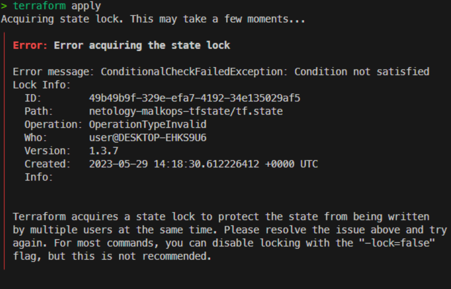
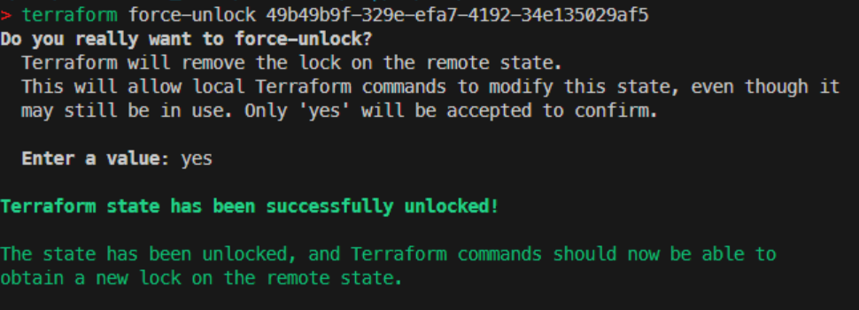

# Домашнее задание к занятию "Использование Terraform в команде"

### Задание 1

1. Возьмите код:
- из [ДЗ к лекции №04](https://github.com/netology-code/ter-homeworks/tree/main/04/src) 
- из [демо к лекции №04](https://github.com/netology-code/ter-homeworks/tree/main/04/demonstration1).
2. Проверьте код с помощью tflint и checkov. Вам не нужно инициализировать этот проект.
3. Перечислите какие **типы** ошибок обнаружены в проекте (без дублей).

_**Для ДЗ 04:**_
  - _**tflint**_
    - _**terraform_required_providers**_
    - _**terraform_unused_declarations**_
  - _**checkov**_
    - _**Perfect**_

_**Для демо 04:**_
  - _**tflint**_
    - _**terraform_required_providers**_
    - _**terraform_unused_declarations**_
    - _**terraform_module_pinned_source**_
  - _**checkov**_
    - _**CKV_YC_2**_
    - _**CKV_YC_11**_

------

### Задание 2

1. Возьмите ваш GitHub репозиторий с **выполненным ДЗ №4** в ветке 'terraform-04' и сделайте из него ветку 'terraform-05'
2. Повторите демонстрацию лекции: настройте YDB, S3 bucket, yandex service account, права доступа и мигрируйте State проекта в S3 с блокировками.
3. Закомитьте в ветку 'terraform-05' все изменения.
4. Откройте в проекте terraform console, а в другом окне из этой же директории попробуйте запустить terraform apply.
5. Пришлите ответ об ошибке доступа к State.
6. Принудительно разблокируйте State. Пришлите команду и вывод.

## 

## 

------
