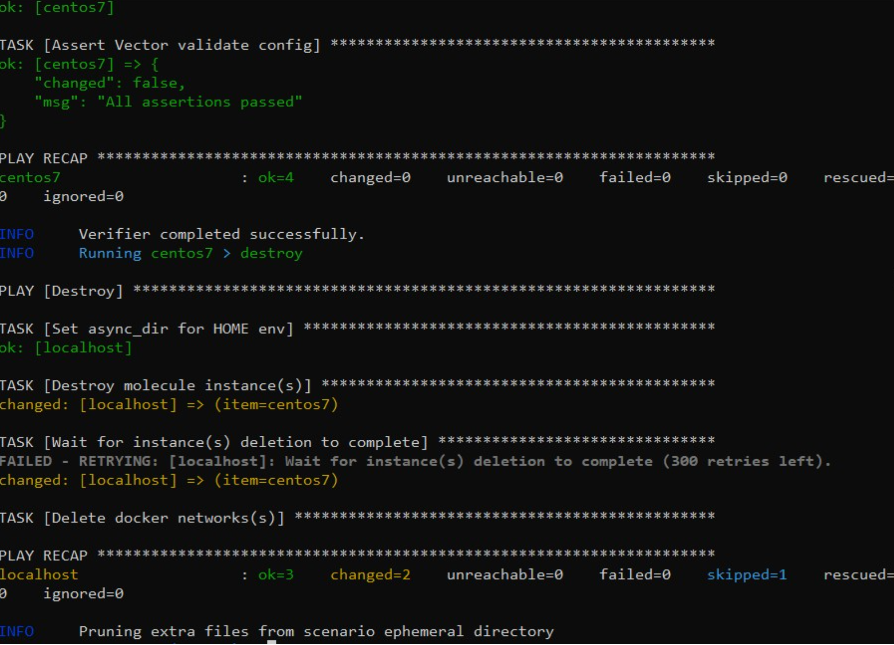
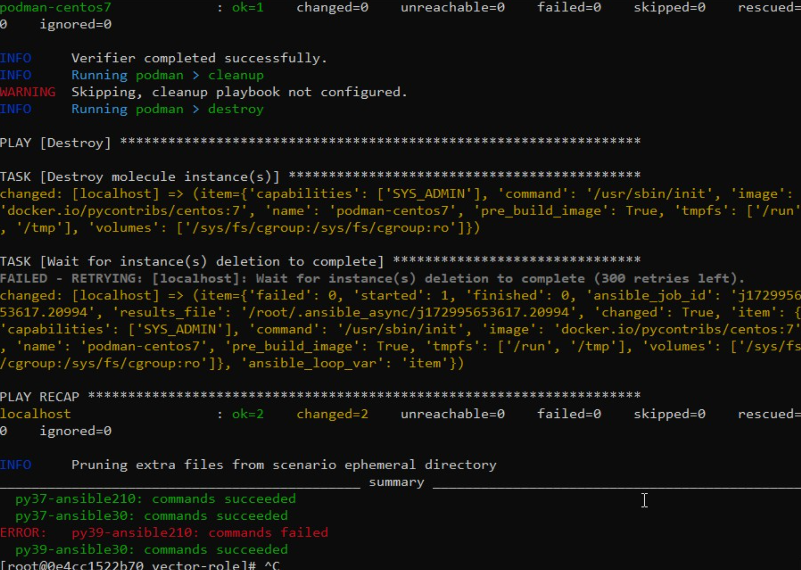

# Домашнее задание к занятию 5 «Тестирование roles»

## Подготовка к выполнению

1. Установите molecule: `pip3 install "molecule==3.5.2"` и драйвера `pip3 install molecule_docker molecule_podman`.
2. Выполните `docker pull aragast/netology:latest` —  это образ с podman, tox и несколькими пайтонами (3.7 и 3.9) внутри.

## Основная часть

Ваша цель — настроить тестирование ваших ролей. 

Задача — сделать сценарии тестирования для vector. 

Ожидаемый результат — все сценарии успешно проходят тестирование ролей.

### Molecule

1. Запустите  `molecule test -s centos_7` внутри корневой директории clickhouse-role, посмотрите на вывод команды. Данная команда может отработать с ошибками, это нормально. Наша цель - посмотреть как другие в реальном мире используют молекулу.

<details><summary>   Вывод ...</summary>
clickhouse git:(main) ✗ molecule test -s centos_7

INFO     centos_7 scenario test matrix: dependency, lint, cleanup, destroy, syntax, create, prepare, converge, idempotence, side_effect, verify, cleanup, destroy
INFO     Performing prerun...
INFO     Set ANSIBLE_LIBRARY=/home/vit/.cache/ansible-compat/7e099f/modules:/home/vit/.ansible/plugins/modules:/usr/share/ansible/plugins/modules
INFO     Set ANSIBLE_COLLECTIONS_PATH=/home/vit/.cache/ansible-compat/7e099f/collections:/home/vit/.ansible/collections:/usr/share/ansible/collections
INFO     Set ANSIBLE_ROLES_PATH=/home/vit/.cache/ansible-compat/7e099f/roles:/home/vit/.ansible/roles:/usr/share/ansible/roles:/etc/ansible/roles
INFO     Inventory /home/vit/devops-netology/bloc-8/8.5-ansible/clickhouse/molecule/centos_7/../resources/inventory/hosts.yml linked to /home/vit/.cache/molecule/clickhouse/centos_7/inventory/hosts
INFO     Inventory /home/vit/devops-netology/bloc-8/8.5-ansible/clickhouse/molecule/centos_7/../resources/inventory/group_vars/ linked to /home/vit/.cache/molecule/clickhouse/centos_7/inventory/group_vars
INFO     Inventory /home/vit/devops-netology/bloc-8/8.5-ansible/clickhouse/molecule/centos_7/../resources/inventory/host_vars/ linked to /home/vit/.cache/molecule/clickhouse/centos_7/inventory/host_vars
INFO     Running centos_7 > dependency
WARNING  Skipping, missing the requirements file.
WARNING  Skipping, missing the requirements file.
INFO     Inventory /home/vit/devops-netology/bloc-8/8.5-ansible/clickhouse/molecule/centos_7/../resources/inventory/hosts.yml linked to /home/vit/.cache/molecule/clickhouse/centos_7/inventory/hosts
INFO     Inventory /home/vit/devops-netology/bloc-8/8.5-ansible/clickhouse/molecule/centos_7/../resources/inventory/group_vars/ linked to /home/vit/.cache/molecule/clickhouse/centos_7/inventory/group_vars
INFO     Inventory /home/vit/devops-netology/bloc-8/8.5-ansible/clickhouse/molecule/centos_7/../resources/inventory/host_vars/ linked to /home/vit/.cache/molecule/clickhouse/centos_7/inventory/host_vars
INFO     Running centos_7 > lint
COMMAND: yamllint .
ansible-lint
flake8

zsh:3: command not found: flake8
CRITICAL Lint failed with error code 127
WARNING  An error occurred during the test sequence action: 'lint'. Cleaning up.
INFO     Inventory /home/vit/devops-netology/bloc-8/8.5-ansible/clickhouse/molecule/centos_7/../resources/inventory/hosts.yml linked to /home/vit/.cache/molecule/clickhouse/centos_7/inventory/hosts
INFO     Inventory /home/vit/devops-netology/bloc-8/8.5-ansible/clickhouse/molecule/centos_7/../resources/inventory/group_vars/ linked to /home/vit/.cache/molecule/clickhouse/centos_7/inventory/group_vars
INFO     Inventory /home/vit/devops-netology/bloc-8/8.5-ansible/clickhouse/molecule/centos_7/../resources/inventory/host_vars/ linked to /home/vit/.cache/molecule/clickhouse/centos_7/inventory/host_vars
INFO     Running centos_7 > cleanup
WARNING  Skipping, cleanup playbook not configured.
INFO     Inventory /home/vit/devops-netology/bloc-8/8.5-ansible/clickhouse/molecule/centos_7/../resources/inventory/hosts.yml linked to /home/vit/.cache/molecule/clickhouse/centos_7/inventory/hosts
INFO     Inventory /home/vit/devops-netology/bloc-8/8.5-ansible/clickhouse/molecule/centos_7/../resources/inventory/group_vars/ linked to /home/vit/.cache/molecule/clickhouse/centos_7/inventory/group_vars
INFO     Inventory /home/vit/devops-netology/bloc-8/8.5-ansible/clickhouse/molecule/centos_7/../resources/inventory/host_vars/ linked to /home/vit/.cache/molecule/clickhouse/centos_7/inventory/host_vars
INFO     Running centos_7 > destroy
INFO     Sanity checks: 'docker'

PLAY [Destroy] *****************************************************************

TASK [Set async_dir for HOME env] **********************************************
ok: [localhost]

TASK [Destroy molecule instance(s)] ********************************************
changed: [localhost] => (item=centos_7)

TASK [Wait for instance(s) deletion to complete] *******************************
FAILED - RETRYING: [localhost]: Wait for instance(s) deletion to complete (300 retries left).
ok: [localhost] => (item=centos_7)

TASK [Delete docker networks(s)] ***********************************************

PLAY RECAP *********************************************************************
localhost                  : ok=3    changed=1    unreachable=0    failed=0    skipped=1    rescued=0    ignored=0

INFO     Pruning extra files from scenario ephemeral directory</details>

2. Перейдите в каталог с ролью vector-role и создайте сценарий тестирования по умолчанию при помощи `molecule init scenario --driver-name docker`.

```bash
 molecule init scenario --driver-name docker
INFO     Initializing new scenario default...
INFO     Initialized scenario in /home/vit/devops-netology/bloc-8/8.5-ansible/vector-role/molecule/default successfully.
```

3. Добавьте несколько разных дистрибутивов (centos:8, ubuntu:latest) для инстансов и протестируйте роль, исправьте найденные ошибки, если они есть.

```bash
добавил инстансы
molecule init scenario ubuntu --driver-name docker
molecule init scenario centos7 --driver-name docker
```

4. Добавьте несколько assert в verify.yml-файл для  проверки работоспособности vector-role (проверка, что конфиг валидный, проверка успешности запуска и др.). 
5. Запустите тестирование роли повторно и проверьте, что оно прошло успешно.

6. Добавьте новый тег на коммит с рабочим сценарием в соответствии с семантическим версионированием.
```
tag v2.0.2
```

### Tox

1. Добавьте в директорию с vector-role файлы из [директории](./example).
2. Запустите `docker run --privileged=True -v <path_to_repo>:/opt/vector-role -w /opt/vector-role -it aragast/netology:latest /bin/bash`, где path_to_repo — путь до корня репозитория с vector-role на вашей файловой системе.
3. Внутри контейнера выполните команду `tox`, посмотрите на вывод.
5. Создайте облегчённый сценарий для `molecule` с драйвером `molecule_podman`. Проверьте его на исполнимость.
6. Пропишите правильную команду в `tox.ini`, чтобы запускался облегчённый сценарий.
8. Запустите команду `tox`. Убедитесь, что всё отработало успешно.

9. Добавьте новый тег на коммит с рабочим сценарием в соответствии с семантическим версионированием.

[molecule tag](https://github.com/basson63/devops-netology-29/releases/tag/v2.0.2)
[tox tag](https://github.com/basson63/devops-netology-29/releases/tag/v2.1.0)

После выполнения у вас должно получится два сценария molecule и один tox.ini файл в репозитории. Не забудьте указать в ответе теги решений Tox и Molecule заданий. В качестве решения пришлите ссылку на  ваш репозиторий и скриншоты этапов выполнения задания. 

## Необязательная часть

1. Проделайте схожие манипуляции для создания роли LightHouse.
2. Создайте сценарий внутри любой из своих ролей, который умеет поднимать весь стек при помощи всех ролей.
3. Убедитесь в работоспособности своего стека. Создайте отдельный verify.yml, который будет проверять работоспособность интеграции всех инструментов между ними.
4. Выложите свои roles в репозитории.

В качестве решения пришлите ссылки и скриншоты этапов выполнения задания.

---

### Как оформить решение задания

Выполненное домашнее задание пришлите в виде ссылки на .md-файл в вашем репозитории.
