# Дипломный практикум в Yandex.Cloud
  * [Цели:](#цели)
  * [Этапы выполнения:](#этапы-выполнения)
     * [Создание облачной инфраструктуры](#создание-облачной-инфраструктуры)
     * [Создание Kubernetes кластера](#создание-kubernetes-кластера)
     * [Создание тестового приложения](#создание-тестового-приложения)
     * [Подготовка cистемы мониторинга и деплой приложения](#подготовка-cистемы-мониторинга-и-деплой-приложения)
     * [Установка и настройка CI/CD](#установка-и-настройка-cicd)
  * [Что необходимо для сдачи задания?](#что-необходимо-для-сдачи-задания)
  * [Как правильно задавать вопросы дипломному руководителю?](#как-правильно-задавать-вопросы-дипломному-руководителю)

**Перед началом работы над дипломным заданием изучите [Инструкция по экономии облачных ресурсов](https://github.com/netology-code/devops-materials/blob/master/cloudwork.MD).**

---
## Цели:

1. Подготовить облачную инфраструктуру на базе облачного провайдера Яндекс.Облако.
2. Запустить и сконфигурировать Kubernetes кластер.
3. Установить и настроить систему мониторинга.
4. Настроить и автоматизировать сборку тестового приложения с использованием Docker-контейнеров.
5. Настроить CI для автоматической сборки и тестирования.
6. Настроить CD для автоматического развёртывания приложения.

---
## Этапы выполнения:


### Создание облачной инфраструктуры

Для начала необходимо подготовить облачную инфраструктуру в ЯО при помощи [Terraform](https://www.terraform.io/).

Особенности выполнения:

- Бюджет купона ограничен, что следует иметь в виду при проектировании инфраструктуры и использовании ресурсов;
Для облачного k8s используйте региональный мастер(неотказоустойчивый). Для self-hosted k8s минимизируйте ресурсы ВМ и долю ЦПУ. В обоих вариантах используйте прерываемые ВМ для worker nodes.
- Следует использовать версию [Terraform](https://www.terraform.io/) не старше 1.5.x .

Предварительная подготовка к установке и запуску Kubernetes кластера.

1. Создайте сервисный аккаунт, который будет в дальнейшем использоваться Terraform для работы с инфраструктурой с необходимыми и достаточными правами. Не стоит использовать права суперпользователя
2. Подготовьте [backend](https://www.terraform.io/docs/language/settings/backends/index.html) для Terraform:  
   а. Рекомендуемый вариант: S3 bucket в созданном ЯО аккаунте(создание бакета через TF)
   б. Альтернативный вариант:  [Terraform Cloud](https://app.terraform.io/)  
3. Создайте VPC с подсетями в разных зонах доступности.
4. Убедитесь, что теперь вы можете выполнить команды `terraform destroy` и `terraform apply` без дополнительных ручных действий.
5. В случае использования [Terraform Cloud](https://app.terraform.io/) в качестве [backend](https://www.terraform.io/docs/language/settings/backends/index.html) убедитесь, что применение изменений успешно проходит, используя web-интерфейс Terraform cloud.

Ожидаемые результаты:

1. Terraform сконфигурирован и создание инфраструктуры посредством Terraform возможно без дополнительных ручных действий.
2. Полученная конфигурация инфраструктуры является предварительной, поэтому в ходе дальнейшего выполнения задания возможны изменения.

---
### Создание Kubernetes кластера

На этом этапе необходимо создать [Kubernetes](https://kubernetes.io/ru/docs/concepts/overview/what-is-kubernetes/) кластер на базе предварительно созданной инфраструктуры.   Требуется обеспечить доступ к ресурсам из Интернета.

Это можно сделать двумя способами:

1. Рекомендуемый вариант: самостоятельная установка Kubernetes кластера.  
   а. При помощи Terraform подготовить как минимум 3 виртуальных машины Compute Cloud для создания Kubernetes-кластера. Тип виртуальной машины следует выбрать самостоятельно с учётом требовании к производительности и стоимости. Если в дальнейшем поймете, что необходимо сменить тип инстанса, используйте Terraform для внесения изменений.  
   б. Подготовить [ansible](https://www.ansible.com/) конфигурации, можно воспользоваться, например [Kubespray](https://kubernetes.io/docs/setup/production-environment/tools/kubespray/)  
   в. Задеплоить Kubernetes на подготовленные ранее инстансы, в случае нехватки каких-либо ресурсов вы всегда можете создать их при помощи Terraform.
2. Альтернативный вариант: воспользуйтесь сервисом [Yandex Managed Service for Kubernetes](https://cloud.yandex.ru/services/managed-kubernetes)  
  а. С помощью terraform resource для [kubernetes](https://registry.terraform.io/providers/yandex-cloud/yandex/latest/docs/resources/kubernetes_cluster) создать **региональный** мастер kubernetes с размещением нод в разных 3 подсетях      
  б. С помощью terraform resource для [kubernetes node group](https://registry.terraform.io/providers/yandex-cloud/yandex/latest/docs/resources/kubernetes_node_group)
  
Ожидаемый результат:

1. Работоспособный Kubernetes кластер.
2. В файле `~/.kube/config` находятся данные для доступа к кластеру.
3. Команда `kubectl get pods --all-namespaces` отрабатывает без ошибок.

---
### Создание тестового приложения

Для перехода к следующему этапу необходимо подготовить тестовое приложение, эмулирующее основное приложение разрабатываемое вашей компанией.

Способ подготовки:

1. Рекомендуемый вариант:  
   а. Создайте отдельный git репозиторий с простым nginx конфигом, который будет отдавать статические данные.  
   б. Подготовьте Dockerfile для создания образа приложения.  
2. Альтернативный вариант:  
   а. Используйте любой другой код, главное, чтобы был самостоятельно создан Dockerfile.

Ожидаемый результат:

1. Git репозиторий с тестовым приложением и Dockerfile.
2. Регистри с собранным docker image. В качестве регистри может быть DockerHub или [Yandex Container Registry](https://cloud.yandex.ru/services/container-registry), созданный также с помощью terraform.

---
### Подготовка cистемы мониторинга и деплой приложения

Уже должны быть готовы конфигурации для автоматического создания облачной инфраструктуры и поднятия Kubernetes кластера.  
Теперь необходимо подготовить конфигурационные файлы для настройки нашего Kubernetes кластера.

Цель:
1. Задеплоить в кластер [prometheus](https://prometheus.io/), [grafana](https://grafana.com/), [alertmanager](https://github.com/prometheus/alertmanager), [экспортер](https://github.com/prometheus/node_exporter) основных метрик Kubernetes.
2. Задеплоить тестовое приложение, например, [nginx](https://www.nginx.com/) сервер отдающий статическую страницу.

Способ выполнения:
1. Воспользовать пакетом [kube-prometheus](https://github.com/prometheus-operator/kube-prometheus), который уже включает в себя [Kubernetes оператор](https://operatorhub.io/) для [grafana](https://grafana.com/), [prometheus](https://prometheus.io/), [alertmanager](https://github.com/prometheus/alertmanager) и [node_exporter](https://github.com/prometheus/node_exporter). При желании можете собрать все эти приложения отдельно.
2. Для организации конфигурации использовать [qbec](https://qbec.io/), основанный на [jsonnet](https://jsonnet.org/). Обратите внимание на имеющиеся функции для интеграции helm конфигов и [helm charts](https://helm.sh/)
3. Если на первом этапе вы не воспользовались [Terraform Cloud](https://app.terraform.io/), то задеплойте и настройте в кластере [atlantis](https://www.runatlantis.io/) для отслеживания изменений инфраструктуры. Альтернативный вариант 3 задания: вместо Terraform Cloud или atlantis настройте на автоматический запуск и применение конфигурации terraform из вашего git-репозитория в выбранной вами CI-CD системе при любом комите в main ветку. Предоставьте скриншоты работы пайплайна из CI/CD системы.

Ожидаемый результат:
1. Git репозиторий с конфигурационными файлами для настройки Kubernetes.
2. Http доступ к web интерфейсу grafana.
3. Дашборды в grafana отображающие состояние Kubernetes кластера.
4. Http доступ к тестовому приложению.

---
### Установка и настройка CI/CD

Осталось настроить ci/cd систему для автоматической сборки docker image и деплоя приложения при изменении кода.

Цель:

1. Автоматическая сборка docker образа при коммите в репозиторий с тестовым приложением.
2. Автоматический деплой нового docker образа.

Можно использовать [teamcity](https://www.jetbrains.com/ru-ru/teamcity/), [jenkins](https://www.jenkins.io/), [GitLab CI](https://about.gitlab.com/stages-devops-lifecycle/continuous-integration/) или GitHub Actions.

Ожидаемый результат:

1. Интерфейс ci/cd сервиса доступен по http.
2. При любом коммите в репозиторие с тестовым приложением происходит сборка и отправка в регистр Docker образа.
3. При создании тега (например, v1.0.0) происходит сборка и отправка с соответствующим label в регистри, а также деплой соответствующего Docker образа в кластер Kubernetes.

---
## Что необходимо для сдачи задания?

1. Репозиторий с конфигурационными файлами Terraform и готовность продемонстрировать создание всех ресурсов с нуля.
2. Пример pull request с комментариями созданными atlantis'ом или снимки экрана из Terraform Cloud или вашего CI-CD-terraform pipeline.
3. Репозиторий с конфигурацией ansible, если был выбран способ создания Kubernetes кластера при помощи ansible.
4. Репозиторий с Dockerfile тестового приложения и ссылка на собранный docker image.
5. Репозиторий с конфигурацией Kubernetes кластера.
6. Ссылка на тестовое приложение и веб интерфейс Grafana с данными доступа.
7. Все репозитории рекомендуется хранить на одном ресурсе (github, gitlab)

# Решение

---

<a id="1"></a>
## Создание облачной инфраструктуры

1. Получим IAM-токен для работы с Yandex Cloud:

yc iam create-token
```
t1.9eue*********-*********MvODw
```
2. Сохраним IAM-токен и остальные параметры в соответствующие переменные окружения `yc`: 
``` 
export YC_TOKEN=$(yc iam create-token) 
export YC_CLOUD_ID=$(yc config get cloud-id) 
export YC_FOLDER_ID=$(yc config get folder-id) 
export YC_ZONE=$(yc config get compute-default-zone) 

```

3. Выполним настройку зеркала провайдера Yandex Cloud для Terraform, добавив файл `~/.terraformrc`:
```
[root@vm:]# cat ~/.terraformrc
provider_installation {
  network_mirror {
    url = "https://terraform-mirror.yandexcloud.net/"
    include = ["registry.terraform.io/*/*"]
  }
  direct {
    exclude = ["registry.terraform.io/*/*"]
  }
}

```

4. Были созданы конфигурационные файлы 
 - main.tf в котором было описано (подключение провайдера, создание сервисного аккаунта, добавление роли, создание S3-bucket'a с именем "diplom"):
 - variable.tf в котором были указаны перменные;
 - network.tf в котором описан VPC с подсетями в разных зонах доступности;

 Terraform успешно инициализирован.

Результат выполнения команды terraform init:
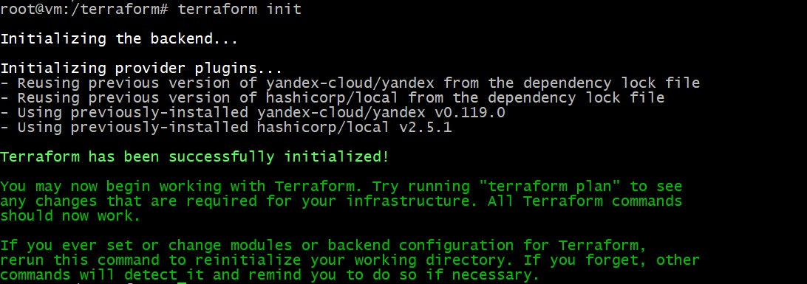

Результат выполнения команды terraform validate:
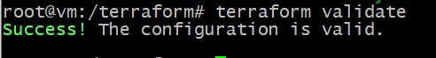

Результат выполнения команды terraform plan:
+ Terraform used the selected providers to generate the following execution plan. Resource actions are indicated with the following symbols:
  + create

Terraform will perform the following actions:

 + # local_file.backend will be created
  + resource "local_file" "backend" {
      + content              = (sensitive value)
      + content_base64sha256 = (known after apply)
      + content_base64sha512 = (known after apply)
      + content_md5          = (known after apply)
      + content_sha1         = (known after apply)
      + content_sha256       = (known after apply)
      + content_sha512       = (known after apply)
      + directory_permission = "0777"
      + file_permission      = "0777"
      + filename             = "./backend.key"
      + id                   = (known after apply)
    }

  # yandex_iam_service_account.sa will be created
  + resource "yandex_iam_service_account" "sa" {
      + created_at  = (known after apply)
      + description = "Service account"
      + folder_id   = "b1gm549jb8foho4i61nr"
      + id          = (known after apply)
      + name        = "sa"
    }

  # yandex_iam_service_account_static_access_key.sa-static_key will be created
  + resource "yandex_iam_service_account_static_access_key" "sa-static_key" {
      + access_key           = (known after apply)
      + created_at           = (known after apply)
      + description          = "Static access key for object storage"
      + encrypted_secret_key = (known after apply)
      + id                   = (known after apply)
      + key_fingerprint      = (known after apply)
      + secret_key           = (sensitive value)
      + service_account_id   = (known after apply)
    }

  # yandex_kms_symmetric_key.key-a will be created
  + resource "yandex_kms_symmetric_key" "key-a" {
      + created_at          = (known after apply)
      + default_algorithm   = "AES_128"
      + deletion_protection = false
      + description         = "Simmetric key"
      + folder_id           = "b1gm549jb8foho4i61nr"
      + id                  = (known after apply)
      + name                = "symmetric-key"
      + rotated_at          = (known after apply)
      + rotation_period     = "8760h"
      + status              = (known after apply)
    }

  # yandex_resourcemanager_folder_iam_binding.editor will be created
  + resource "yandex_resourcemanager_folder_iam_binding" "editor" {
      + folder_id = "b1gm549jb8foho4i61nr"
      + id        = (known after apply)
      + members   = (known after apply)
      + role      = "editor"
    }

  # yandex_resourcemanager_folder_iam_binding.encrypterDecrypter will be created
  + resource "yandex_resourcemanager_folder_iam_binding" "encrypterDecrypter" {
      + folder_id = "b1gm549jb8foho4i61nr"
      + id        = (known after apply)
      + members   = (known after apply)
      + role      = "kms.keys.encrypterDecrypter"
    }

  # yandex_resourcemanager_folder_iam_binding.storage-admin will be created
  + resource "yandex_resourcemanager_folder_iam_binding" "storage-admin" {
      + folder_id = "b1gm549jb8foho4i61nr"
      + id        = (known after apply)
      + members   = (known after apply)
      + role      = "storage.admin"
    }

  # yandex_storage_bucket.diplom will be created
  + resource "yandex_storage_bucket" "diplom" {
      + access_key            = (known after apply)
      + acl                   = "public-read"
      + bucket                = "diplom"
      + bucket_domain_name    = (known after apply)
      + default_storage_class = "STANDARD"
      + folder_id             = (known after apply)
      + force_destroy         = true
      + id                    = (known after apply)
      + secret_key            = (sensitive value)
      + website_domain        = (known after apply)
      + website_endpoint      = (known after apply)

      + anonymous_access_flags {
          + config_read = true
          + list        = true
          + read        = true
        }

      + server_side_encryption_configuration {
          + rule {
              + apply_server_side_encryption_by_default {
                  + kms_master_key_id = (known after apply)
                  + sse_algorithm     = "aws:kms"
                }
            }
        }
    }

  # yandex_storage_object.object-2 will be created
  + resource "yandex_storage_object" "object-2" {
      + access_key   = (known after apply)
      + acl          = "private"
      + bucket       = "diplom"
      + content_type = (known after apply)
      + id           = (known after apply)
      + key          = "terraform.tfstate"
      + secret_key   = (sensitive value)
      + source       = "./terraform.tfstate"
    }

  # yandex_vpc_network.network-diploma will be created
  + resource "yandex_vpc_network" "network-diploma" {
      + created_at                = (known after apply)
      + default_security_group_id = (known after apply)
      + folder_id                 = "b1gm549jb8foho4i61nr"
      + id                        = (known after apply)
      + labels                    = (known after apply)
      + name                      = "network-diploma"
      + subnet_ids                = (known after apply)
    }

  # yandex_vpc_subnet.subnet-a will be created
  + resource "yandex_vpc_subnet" "subnet-a" {
      + created_at     = (known after apply)
      + folder_id      = "b1gm549jb8foho4i61nr"
      + id             = (known after apply)
      + labels         = (known after apply)
      + name           = "subnet-a"
      + network_id     = (known after apply)
      + v4_cidr_blocks = [
          + "192.168.10.0/24",
        ]
      + v6_cidr_blocks = (known after apply)
      + zone           = "ru-central1-a"
    }

  # yandex_vpc_subnet.subnet-b will be created
  + resource "yandex_vpc_subnet" "subnet-b" {
      + created_at     = (known after apply)
      + folder_id      = "b1gm549jb8foho4i61nr"
      + id             = (known after apply)
      + labels         = (known after apply)
      + name           = "subnet-b"
      + network_id     = (known after apply)
      + v4_cidr_blocks = [
          + "192.168.20.0/24",
        ]
      + v6_cidr_blocks = (known after apply)
      + zone           = "ru-central1-b"
    }

  # yandex_vpc_subnet.subnet-c will be created
  + resource "yandex_vpc_subnet" "subnet-c" {
      + created_at     = (known after apply)
      + folder_id      = "b1gm549jb8foho4i61nr"
      + id             = (known after apply)
      + labels         = (known after apply)
      + name           = "subnet-c"
      + network_id     = (known after apply)
      + v4_cidr_blocks = [
          + "192.168.30.0/24",
        ]
      + v6_cidr_blocks = (known after apply)
      + zone           = "ru-central1-c"
    }

Plan: 13 to add, 0 to change, 0 to destroy.


```

```
* Применим конфигурацию, описанную в `main.tf`:

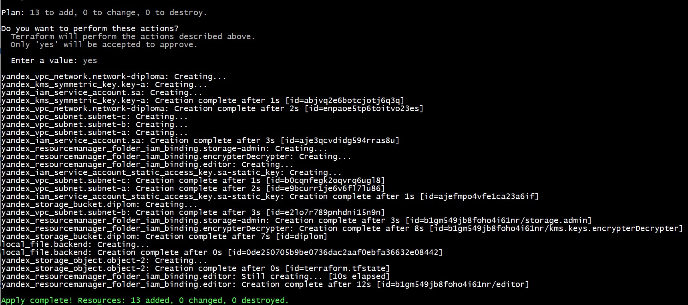
```


* Подтвердим успешность создания ресурсов и задействования S3-bucket'а скриншотами:
```
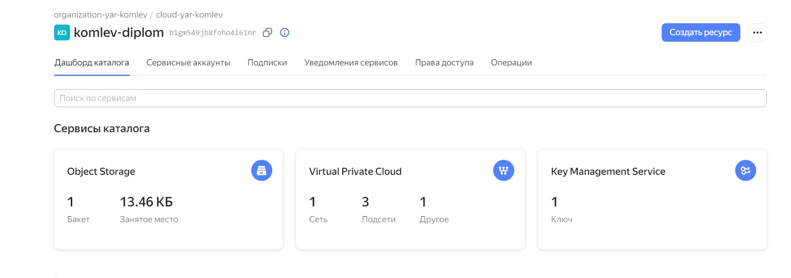 
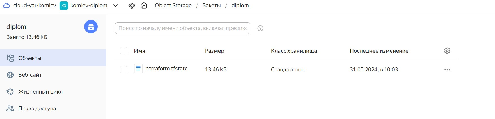
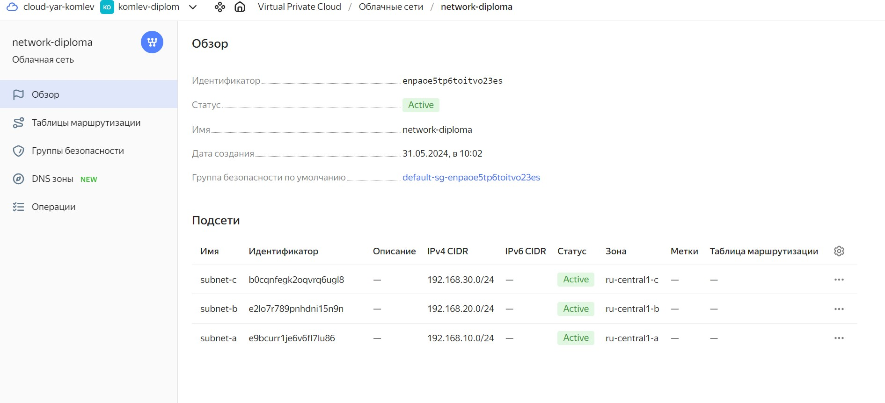

```

---

<a id="2"></a>
## Создание Kubernetes кластера

<a id="2-1"></a>
### Подготовка виртуальных машин Compute Cloud для создания Kubernetes-кластера
1. Создадим файл `vm.tf` в котором будет описано три виртуальные машины, одна master и две worker в разных зонах доступности:
```
# Virtual machines
## Kubernetes master
resource "yandex_compute_instance" "vm-master" {
  name = "vm-master"
  hostname = "vm-master"
  zone      = "ru-central1-a"
  resources {
    cores  = 2
    memory = 4
  }
  boot_disk {
    initialize_params {
      image_id = "fd826honb8s0i1jtt6cg"
      size = "10"
    }
  }
  network_interface {
    subnet_id = yandex_vpc_subnet.subnet-a.id
    nat       = true
  }
  metadata = {
    ssh-keys = "ubuntu:${file("~/.ssh/id_rsa.pub")}"
  }
}

## Kubernetes worker-1
resource "yandex_compute_instance" "vm-worker-1" {
  name = "vm-worker-1"
  hostname = "vm-worker-1"
  zone      = "ru-central1-a"
  resources {
    cores  = 2
    memory = 2
  }
  boot_disk {
    initialize_params {
      image_id = "fd826honb8s0i1jtt6cg"
      size = "10"
    }
  }
  network_interface {
    subnet_id = yandex_vpc_subnet.subnet-a.id
    nat       = true
  }
  metadata = {
    ssh-keys = "ubuntu:${file("~/.ssh/id_rsa.pub")}"
  }
}

## Kubernetes worker-2
resource "yandex_compute_instance" "vm-worker-2" {
  name = "vm-worker-2"
  hostname = "vm-worker-2"
  zone      = "ru-central1-b"
  resources {
    cores  = 2
    memory = 2
  }
  boot_disk {
    initialize_params {
      image_id = "fd826honb8s0i1jtt6cg"
      size = "10"
    }
  }
  network_interface {
    subnet_id = yandex_vpc_subnet.subnet-b.id
    nat       = true
  }
  metadata = {
    ssh-keys = "ubuntu:${file("~/.ssh/id_rsa.pub")}"
  }
}


```

2. Создадим файл `output.tf` с информацией об отображении интересующих ресурсов. 
```
# Output
output "internal-ip-address-vm-master" {
  value = "${yandex_compute_instance.vm-master.network_interface.0.ip_address}"
}
output "fqdn-vm-master" {
  value = "${yandex_compute_instance.vm-master.fqdn}"
}
```

3. Применим описанные конфигурации для развертывания виртуальных машин Compute Cloud
```

yandex_compute_instance.vm-worker-1: Creating...
yandex_compute_instance.vm-master: Creating...
yandex_compute_instance.vm-worker-2: Creating...
yandex_compute_instance.vm-worker-1: Still creating... [10s elapsed]
yandex_compute_instance.vm-master: Still creating... [10s elapsed]
yandex_compute_instance.vm-worker-2: Still creating... [10s elapsed]
yandex_compute_instance.vm-worker-1: Still creating... [20s elapsed]
yandex_compute_instance.vm-master: Still creating... [20s elapsed]
yandex_compute_instance.vm-worker-2: Still creating... [20s elapsed]
yandex_compute_instance.vm-worker-1: Still creating... [30s elapsed]
yandex_compute_instance.vm-master: Still creating... [30s elapsed]
yandex_compute_instance.vm-worker-2: Still creating... [30s elapsed]
yandex_compute_instance.vm-worker-1: Creation complete after 35s [id=fhm3sphj9bu6e2vg8is4]
yandex_compute_instance.vm-master: Still creating... [40s elapsed]
yandex_compute_instance.vm-worker-2: Still creating... [40s elapsed]
yandex_compute_instance.vm-master: Creation complete after 41s [id=fhmfj0gq2h8ph0r95jhi]
yandex_compute_instance.vm-worker-2: Still creating... [50s elapsed]
yandex_compute_instance.vm-worker-2: Still creating... [1m0s elapsed]
yandex_compute_instance.vm-worker-2: Creation complete after 1m4s [id=epdn9976pokmk0d0kj7d]

Apply complete! Resources: 3 added, 0 changed, 0 destroyed.

Outputs:

fqdn-vm-master = "vm-master.ru-central1.internal"
internal-ip-address-vm-master = "192.168.10.6"

```

4. Виртуальные машины созданы корректно. Подтвердим результат их создания скриншотом:
```

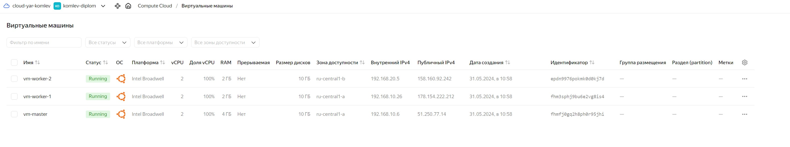


<a id="2-2"></a>
### Подготовка ansible-конфигурации Kubespray
*Для подготовки ansible-конфигурации необходимо сформировать:
1) предварительный ansible-playbook, выполняющий подготовку узлов для установки Kubernetes методом Kubespray;
2) inventory-файл для предварительного ansible-playbook'a;
3) комплексный inventory-файл для отработки инструмента Kubespray;

1. Предварительный ansible-playbook, выполняющий подготовку узлов для установки Kubernetes методом Kubespray, будет выглядеть следующим образом:
```
root@vm:/terraform/ansible#cat prep.yaml
---
- name: prep
  hosts: kube-cloud
  become: true
  tasks:
    - name: packages-update
      apt:
        update_cache: yes

    - name: Install packages
      apt:
        name:
          - git
          - python3-pip
        state: present

    - name: clone Kubespray repo
      git:
        repo: https://github.com/kubernetes-sigs/kubespray.git
        dest: ~/kubespray

    - name: Install requirements
      pip:
        requirements: ~/kubespray/requirements.txt

```

2. Inventory-файл для предварительного ansible-playbook'a будем формировать автоматически с помощью terraform. Для этого создадим файл `ansible.tf`:
```
## Ansible inventory for preparation
resource "local_file" "inventory-preparation" {
  content = <<EOF1
[kube-cloud]
${yandex_compute_instance.vm-master.network_interface.0.nat_ip_address}
${yandex_compute_instance.vm-worker-1.network_interface.0.nat_ip_address}
${yandex_compute_instance.vm-worker-2.network_interface.0.nat_ip_address}
  EOF1
  filename = "./ansible/inventory-preparation"
  depends_on = [yandex_compute_instance.vm-master, yandex_compute_instance.vm-worker-1, yandex_compute_instance.vm-worker-2]
}
```

3. Комплексный inventory-файл для отработки инструмента Kubespray также будем формировать автоматически с помощью terraform. Для этого дополним имеющийся файл `ansible.tf` следующим блоком:
```
## Ansible inventory for Kuberspray
resource "local_file" "inventory-kubespray" {
  content = <<EOF2
all:
  hosts:
    ${yandex_compute_instance.vm-master.fqdn}:
      ansible_host: ${yandex_compute_instance.vm-master.network_interface.0.ip_address}
      ip: ${yandex_compute_instance.vm-master.network_interface.0.ip_address}
      access_ip: ${yandex_compute_instance.vm-master.network_interface.0.ip_address}
    ${yandex_compute_instance.vm-worker-1.fqdn}:
      ansible_host: ${yandex_compute_instance.vm-worker-1.network_interface.0.ip_address}
      ip: ${yandex_compute_instance.vm-worker-1.network_interface.0.ip_address}
      access_ip: ${yandex_compute_instance.vm-worker-1.network_interface.0.ip_address}
    ${yandex_compute_instance.vm-worker-2.fqdn}:
      ansible_host: ${yandex_compute_instance.vm-worker-2.network_interface.0.ip_address}
      ip: ${yandex_compute_instance.vm-worker-2.network_interface.0.ip_address}
      access_ip: ${yandex_compute_instance.vm-worker-2.network_interface.0.ip_address}
  children:
    kube_control_plane:
      hosts:
        ${yandex_compute_instance.vm-master.fqdn}:
    kube_node:
      hosts:
        ${yandex_compute_instance.vm-worker-1.fqdn}:
        ${yandex_compute_instance.vm-worker-2.fqdn}:
    etcd:
      hosts:
        ${yandex_compute_instance.vm-master.fqdn}:
    k8s_cluster:
      children:
        kube_control_plane:
        kube_node:
    calico_rr:
      hosts: {}
  EOF2
  filename = "./ansible/inventory-kubespray"
  depends_on = [yandex_compute_instance.vm-master, yandex_compute_instance.vm-worker-1, yandex_compute_instance.vm-worker-2]
}
```
* Далее необходимо применить `ansible.tf`, убедиться в корректности его работы и проверить сформированные им inventory-файлы `inventory-preparation` и `inventory-kubespray`:
```
Terraform used the selected providers to generate the following execution plan. Resource actions are indicated with the following symbols:
  + create

Terraform will perform the following actions:

  # local_file.inventory-kubespray will be created
  + resource "local_file" "inventory-kubespray" {
      + content              = <<-EOT
            all:
              hosts:
                vm-master.ru-central1.internal:
                  ansible_host: 192.168.10.6
                  ip: 192.168.10.6
                  access_ip: 192.168.10.6
                vm-worker-1.ru-central1.internal:
                  ansible_host: 192.168.10.26
                  ip: 192.168.10.26
                  access_ip: 192.168.10.26
                vm-worker-2.ru-central1.internal:
                  ansible_host: 192.168.20.5
                  ip: 192.168.20.5
                  access_ip: 192.168.20.5
              children:
                kube_control_plane:
                  hosts:
                    vm-master.ru-central1.internal:
                kube_node:
                  hosts:
                    vm-worker-1.ru-central1.internal:
                    vm-worker-2.ru-central1.internal:
                etcd:
                  hosts:
                    vm-master.ru-central1.internal:
                k8s_cluster:
                  children:
                    kube_control_plane:
                    kube_node:
                calico_rr:
                  hosts: {}
        EOT
      + content_base64sha256 = (known after apply)
      + content_base64sha512 = (known after apply)
      + content_md5          = (known after apply)
      + content_sha1         = (known after apply)
      + content_sha256       = (known after apply)
      + content_sha512       = (known after apply)
      + directory_permission = "0777"
      + file_permission      = "0777"
      + filename             = "./ansible/inventory-kubespray"
      + id                   = (known after apply)
    }

  # local_file.inventory-preparation will be created
  + resource "local_file" "inventory-preparation" {
      + content              = <<-EOT
            [kube-cloud]
	    158.160.90.20
	    158.160.125.138
            51.250.11.200

        EOT
      + content_base64sha256 = (known after apply)
      + content_base64sha512 = (known after apply)
      + content_md5          = (known after apply)
      + content_sha1         = (known after apply)
      + content_sha256       = (known after apply)
      + content_sha512       = (known after apply)
      + directory_permission = "0777"
      + file_permission      = "0777"
      + filename             = "./ansible/inventory-preparation"
      + id                   = (known after apply)
    }

Plan: 2 to add, 0 to change, 0 to destroy.

Do you want to perform these actions?
  Terraform will perform the actions described above.
  Only 'yes' will be accepted to approve.

  Enter a value: yes

local_file.inventory-kubespray: Creating...
local_file.inventory-kubespray: Creation complete after 0s [id=0a9026bd84e215ba37b9eb152f3b5d3861902a83]
local_file.inventory-preparation: Creating...
local_file.inventory-preparation: Creation complete after 0s [id=aab02826c48f277ab2b3f3d156baee0fe800973c]

Apply complete! Resources: 2 added, 0 changed, 0 destroyed.

Outputs:

fqdn-vm-master = "vm-master.ru-central1.internal"
internal-ip-address-vm-master = "192.168.10.6"
```

* Inventory-файлы были сформированы корректно. Переходим к развертыванию ресурсов с помощью ansible.

<a id="2-3"></a>
### Развертывание Kubernetes кластера с помощью Kubespray
1. Запустим вышеописанный ansible-playbook, выполняющий подготовку узлов для установки Kubernetes методом Kubespray:
```
root@vm:/terraform/ansible# ansible-playbook -i inventory-preparation -u ubuntu prep.yaml -b -v
No config file found; using defaults

PLAY [prep] **************************************************************************************************************************************************

TASK [Gathering Facts] ***************************************************************************************************************************************
ok: [51.250.11.200]
ok: [158.160.125.138]
ok: [158.160.90.20]

TASK [packages-update] ***************************************************************************************************************************************
changed: [158.160.125.138] => {"cache_update_time": 1717260312, "cache_updated": true, "changed": true}
changed: [51.250.11.200] => {"cache_update_time": 1717260312, "cache_updated": true, "changed": true}
changed: [158.160.90.20] => {"cache_update_time": 1717260322, "cache_updated": true, "changed": true}

TASK [Install packages] **************************************************************************************************************************************
ok: [51.250.11.200] => {"cache_update_time": 1717260312, "cache_updated": false, "changed": false}
ok: [158.160.125.138] => {"cache_update_time": 1717260312, "cache_updated": false, "changed": false}
TASK [clone Kubespray repo] **********************************************************************************************************************************
ok: [158.160.125.138] => {"after": "351393e32a04add0459e02e3a60af5648db9bfe4", "before": "351393e32a04add0459e02e3a60af5648db9bfe4", "changed": false, "remote_url_changed": false}
ok: [51.250.11.200] => {"after": "351393e32a04add0459e02e3a60af5648db9bfe4", "before": "351393e32a04add0459e02e3a60af5648db9bfe4", "changed": false, "remote_url_changed": false}
changed: [158.160.90.20] => {"after": "351393e32a04add0459e02e3a60af5648db9bfe4", "before": null, "changed": true}

TASK [Install requirements] **********************************************************************************************************************************
-------------------------ВЫВОД ПРОПУЩЕН-----------------------------------
PLAY RECAP ***************************************************************************************************************************************************
158.160.125.138            : ok=5    changed=1    unreachable=0    failed=0    skipped=0    rescued=0    ignored=0
158.160.90.20              : ok=5    changed=4    unreachable=0    failed=0    skipped=0    rescued=0    ignored=0
51.250.11.200              : ok=5    changed=1    unreachable=0    failed=0    skipped=0    rescued=0    ignored=0

2. Ansible-playbook отработал корректно. Далее скопируем закрытый ключ и сформированный inventory-kubespray с локальной машины на мастер-ноду
```
[root@vm:]# rsync --rsync-path="sudo rsync" /root/.ssh/id_rsa ubuntu@62.84.118.89:/root/.ssh/id_rsa
[root@vm:]# rsync --rsync-path="sudo rsync" ./ansible/inventory-kubespray ubuntu@62.84.118.89:/root/kubespray/inventory/
```
2.1 Так как dockerHub заблокировали на территории РФ, пришлось добавлять зеркало по этой статье: "https://github.com/kubernetes-sigs/kubespray/blob/master/docs/operations/mirror.md"

3. С мастер-ноды запустим развертывание Kubernetes методом Kubespray:
```
root@vm-master:~/kubespray# ansible-playbook -i inventory/inventory-kubespray -u ubuntu -b -v --private-key=/root/.ssh/id_rsa cluster.yml
-------------------------ВЫВОД ПРОПУЩЕН-----------------------------------
Monday 03 June 2024  08:04:06 +0000 (0:00:00.081)       0:16:22.608 ***********
Monday 03 June 2024  08:04:06 +0000 (0:00:00.048)       0:16:22.657 ***********
Monday 03 June 2024  08:04:06 +0000 (0:00:00.047)       0:16:22.704 ***********

PLAY RECAP ***************************************************************************************************************************************************
vm-master.ru-central1.internal : ok=624  changed=101  unreachable=0    failed=0    skipped=1104 rescued=0    ignored=6
vm-worker-1.ru-central1.internal : ok=409  changed=51   unreachable=0    failed=0    skipped=663  rescued=0    ignored=1
vm-worker-2.ru-central1.internal : ok=409  changed=51   unreachable=0    failed=0    skipped=659  rescued=0    ignored=1

Monday 03 June 2024  08:04:06 +0000 (0:00:00.203)       0:16:22.908 ***********
===============================================================================
network_plugin/calico : Wait for calico kubeconfig to be created ------------------------------------------------------------------------------------- 68.37s
kubernetes/control-plane : Kubeadm | Initialize first master ----------------------------------------------------------------------------------------- 57.32s
network_plugin/calico : Calico | Copy calicoctl binary from download dir ----------------------------------------------------------------------------- 31.73s
kubernetes/preinstall : Update package management cache (APT) ---------------------------------------------------------------------------------------- 31.17s
kubernetes/kubeadm : Join to cluster ----------------------------------------------------------------------------------------------------------------- 28.55s
download : Download_file | Download item ------------------------------------------------------------------------------------------------------------- 25.06s
container-engine/containerd : Containerd | Unpack containerd archive --------------------------------------------------------------------------------- 21.12s
kubernetes/preinstall : Preinstall | wait for the apiserver to be running ---------------------------------------------------------------------------- 18.56s
container-engine/runc : Download_file | Download item ------------------------------------------------------------------------------------------------ 17.63s
network_plugin/cni : CNI | Copy cni plugins ---------------------------------------------------------------------------------------------------------- 14.55s
download : Download_container | Download image if required ------------------------------------------------------------------------------------------- 12.93s
download : Extract_file | Unpacking archive ---------------------------------------------------------------------------------------------------------- 12.65s
container-engine/containerd : Download_file | Download item ------------------------------------------------------------------------------------------ 12.55s
container-engine/crictl : Download_file | Download item ---------------------------------------------------------------------------------------------- 12.00s
container-engine/nerdctl : Download_file | Download item --------------------------------------------------------------------------------------------- 11.76s
bootstrap-os : Fetch /etc/os-release ----------------------------------------------------------------------------------------------------------------- 10.47s
container-engine/crictl : Copy crictl binary from download dir ---------------------------------------------------------------------------------------- 9.63s
kubernetes/node : Pre-upgrade | check if kubelet container exists ------------------------------------------------------------------------------------- 9.43s
container-engine/crictl : Extract_file | Unpacking archive -------------------------------------------------------------------------------------------- 8.90s
kubernetes/kubeadm : Update server field in kubelet kubeconfig ---------------------------------------------------------------------------------------- 8.57s

```
4. Выполним создание и настройку kubeconfig-файла для пользователя ubuntu:
```
root@vm-master::~$ mkdir -p $HOME/.kube
root@vm-master::~$ cp -i /etc/kubernetes/admin.conf $HOME/.kube/config
root@vm-master::~$ chown $(id -u):$(id -g) $HOME/.kube/config
```
<a id="2-4"></a>
### Результаты создания Kubernetes кластера
1. Проверяем состояния нод в кластере Kubernetes:
```
root@vm-master:/# kubectl get nodes
NAME                               STATUS   ROLES           AGE   VERSION
vm-master.ru-central1.internal     Ready    control-plane   33m   v1.29.5
vm-worker-1.ru-central1.internal   Ready    <none>          32m   v1.29.5
vm-worker-2.ru-central1.internal   Ready    <none>          32m   v1.29.5
```


2. Проверяем состояния подов в кластере Kubernetes:
```

root@vm-master:/# kubectl get pods --all-namespaces
NAMESPACE     NAME                                                     READY   STATUS    RESTARTS      AGE
kube-system   calico-kube-controllers-68485cbf9c-fnntv                 1/1     Running   0             29m
kube-system   calico-node-ftxz6                                        1/1     Running   0             31m
kube-system   calico-node-j297w                                        1/1     Running   0             31m
kube-system   calico-node-skqkz                                        1/1     Running   0             31m
kube-system   coredns-69db55dd76-268mx                                 1/1     Running   0             29m
kube-system   coredns-69db55dd76-zb7jk                                 1/1     Running   0             29m
kube-system   dns-autoscaler-6f4b597d8c-5smgn                          1/1     Running   0             29m
kube-system   kube-apiserver-vm-master.ru-central1.internal            1/1     Running   1             33m
kube-system   kube-controller-manager-vm-master.ru-central1.internal   1/1     Running   3             33m
kube-system   kube-proxy-dm4vh                                         1/1     Running   0             32m
kube-system   kube-proxy-npvxf                                         1/1     Running   0             32m
kube-system   kube-proxy-zzhhp                                         1/1     Running   0             32m
kube-system   kube-scheduler-vm-master.ru-central1.internal            1/1     Running   2 (28m ago)   33m
kube-system   nginx-proxy-vm-worker-1.ru-central1.internal             1/1     Running   0             32m
kube-system   nginx-proxy-vm-worker-2.ru-central1.internal             1/1     Running   0             32m
kube-system   nodelocaldns-bhd8n                                       1/1     Running   0             29m
kube-system   nodelocaldns-bkh44                                       1/1     Running   0             29m
kube-system   nodelocaldns-jvb9m                                       1/1     Running   0             29m

```
3. Кластер Kubernetes работает корректно. Подтвердим результат развертывания скриншотами:
```
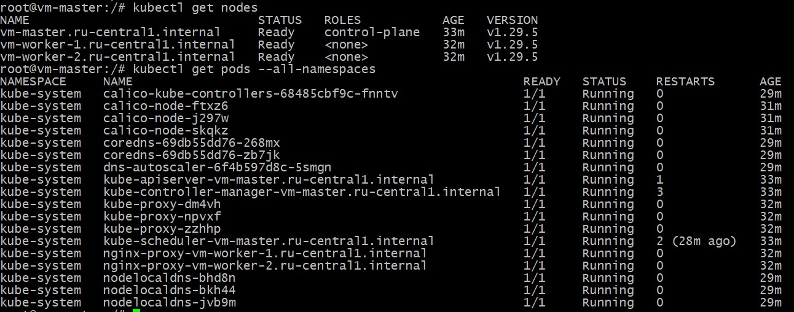
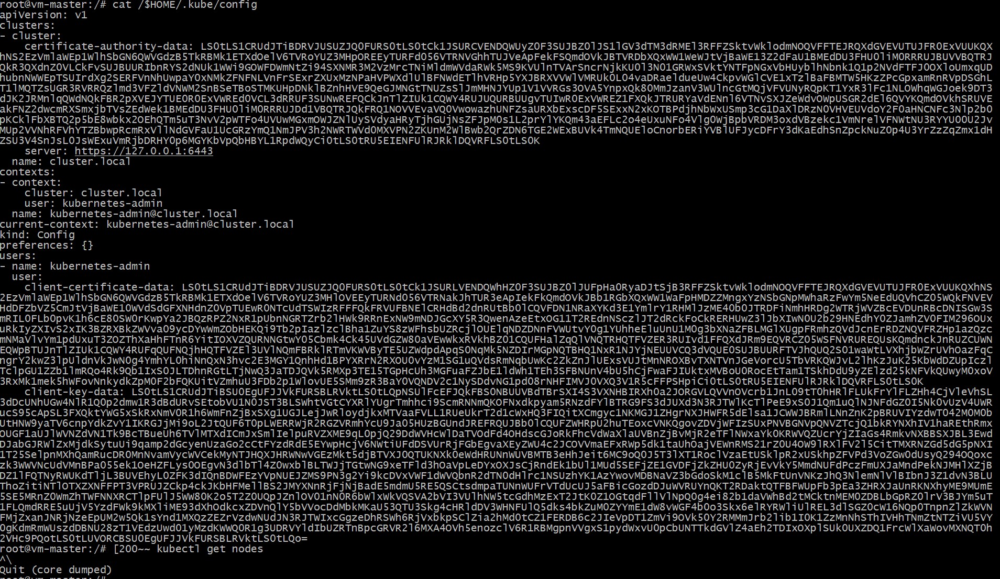
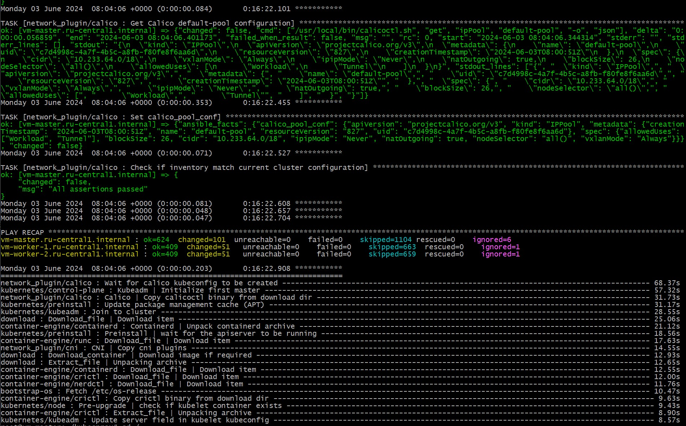


---

<a id="3"></a>
## Создание тестового приложения

<a id="3-1"></a>
### Подготовка инструментов для работы

1. Выполним установку Docker на виртуальную машину
```
root@vm:/terraform# sudo apt-get install docker-ce docker-ce-cli containerd.io docker-buildx-plugin docker-compose-plugin
Reading package lists... Done
Building dependency tree... Done
Reading state information... Done
Package docker-ce is not available, but is referred to by another package.
This may mean that the package is missing, has been obsoleted, or
is only available from another source

E: Package 'docker-ce' has no installation candidate
E: Unable to locate package docker-ce-cli
E: Unable to locate package containerd.io
E: Couldn't find any package by glob 'containerd.io'
E: Couldn't find any package by regex 'containerd.io'
E: Unable to locate package docker-buildx-plugin
E: Unable to locate package docker-compose-plugin
root@vm:/terraform# sudo apt install curl software-properties-common ca-certificates apt-transport-https -y
Reading package lists... Done
Building dependency tree... Done
Reading state information... Done
ca-certificates is already the newest version (20230311ubuntu0.22.04.1).
ca-certificates set to manually installed.
curl is already the newest version (7.81.0-1ubuntu1.16).
curl set to manually installed.
The following additional packages will be installed:
  python3-software-properties
The following NEW packages will be installed:
root@vm:/terraform# sudo systemctl status docker
● docker.service - Docker Application Container Engine
     Loaded: loaded (/lib/systemd/system/docker.service; enabled; vendor preset: enabled)
     Active: active (running) since Sun 2024-06-02 12:37:59 UTC; 9s ago
TriggeredBy: ● docker.socket
       Docs: https://docs.docker.com
   Main PID: 54186 (dockerd)
      Tasks: 9
     Memory: 29.2M
        CPU: 191ms
     CGroup: /system.slice/docker.service
             └─54186 /usr/bin/dockerd -H fd:// --containerd=/run/containerd/containerd.sock

-------------------------ВЫВОД ПРОПУЩЕН-----------------------------------
```
2. Проверим результат установки Docker:
```
root@vm:~# docker --version
Docker version 26.1.3, build b72abbb
```

<a id="3-2"></a>
### Создание Docker-образа приложения
1. Создадим директорию для приложения: 
```
root@vm:/opt/docker/webapp# mkdir docker/webapp
root@vm:/opt/docker/webapp# cd docker/webapp
```

2. Создадим статическую страницу веб-приложения:
```
root@vm:~/docker# cat index.html
<html>
<head>
Example web-page for diploma
</head>
<body>
<h1>Komlev Yaroslav v0.1</h1>
</body>
</html>
```
3. Создадим `Dockerfile` для последующей сборки образа:
```
root@vm:~/docker# cat Dockerfile
FROM nginx:latest
RUN rm -rf /usr/share/nginx/html/*
COPY index.html /usr/share/nginx/html/
EXPOSE 80
```
4. Выполним сборку образа на основе `Dockerfile`:
```
Так как 30.05.2024 Doсkerhub был заблокирован для пользователей РФ, пришлось внести изменения в файл конфигурации "/etc/docker/daemon.json". 
В файле прописал это зеркало: "https://huecker.io".

root@vm:/opt/docker/webapp# docker build -t komlev_webapp:v1 .
ot@vm:/opt/docker/webapp# docker build -t komlevyaroslav/webapp-diplom:v0.0.1 .
DEPRECATED: The legacy builder is deprecated and will be removed in a future release.
            BuildKit is currently disabled; enable it by removing the DOCKER_BUILDKIT=0
            environment-variable.

Sending build context to Docker daemon  3.072kB
Step 1/4 : FROM nginx:latest
latest: Pulling from library/nginx
09f376ebb190: Pull complete
5529e0792248: Pull complete
9b3addd3eb3d: Pull complete
57910a8c4316: Pull complete
7b5f78f21449: Pull complete
b7923aa4e8a6: Pull complete
785625911f12: Pull complete
Digest: sha256:0f04e4f646a3f14bf31d8bc8d885b6c951fdcf42589d06845f64d18aec6a3c4d
Status: Downloaded newer image for nginx:latest
 ---> 4f67c83422ec
Step 2/4 : RUN rm -rf /usr/share/nginx/html/*
 ---> Running in 734a684be6c2
 ---> Removed intermediate container 734a684be6c2
 ---> 53168235bc1b
Step 3/4 : COPY index.html /usr/share/nginx/html/
 ---> 7b5c51621684
Step 4/4 : EXPOSE 80
 ---> Running in 1bd6d01b75f1
 ---> Removed intermediate container 1bd6d01b75f1
 ---> db22a1ca0e92
Successfully built db22a1ca0e92
Successfully tagged komlevyaroslav/webapp-diplom:v0.0.1
```
* Сборка образа выполнена успешно

<a id="3-3"></a>
### Отправка Docker-образа в YC Container Registry
1. Создадим репозиторий `my-first-registry` на YC
```
root@vm:/terraform# yc container registry create --name my-first-registry
done (1s)
id: crpnd3c1v7u8mu4nu23m
folder_id: b1gm549jb8foho4i61nr
name: my-first-registry
status: ACTIVE
created_at: "2024-06-02T12:33:47.220Z

2. Отправим созданный образ на YC Container Registry
- перед отправкой, присвоим образу "tag"
```
root@vm:/opt/docker/webapp# docker tag db22a1ca0e92 cr.yandex/crpmh7guhbh8fj5qs00k/komlev_webapp:v1

root@vm:/opt/docker/webapp# docker push cr.yandex/crpmh7guhbh8fj5qs00k/komlev_webapp:v1
The push refers to repository [cr.yandex/crpmh7guhbh8fj5qs00k/komlev_webapp]
bf9fa217757d: Pushed
d024f83b5880: Pushed
3f6a3d22b9ce: Pushed
261a5dc153b4: Pushed
7da4ba4a0030: Pushed
10988c108f66: Pushed
d58e4a0f2971: Pushed
37719940dcaa: Pushed
5d4427064ecc: Pushed
v1: digest: sha256:ce9fb633a0929dbc3032878c9afe3f853c8380140e6020cb19ff0ae47267386a size: 2192

```
3. Проверим успешность загрузки образа на YC Container Registry:
```

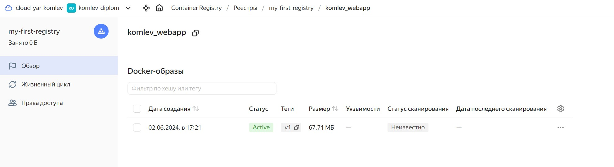
* Образ успешно загружен.
[YC Container Registry](https://console.yandex.cloud/folders/b1gm549jb8foho4i61nr/container-registry/registries/crpmh7guhbh8fj5qs00k/overview/komlev_webapp/image)
Отдельный git репозиторий с простым nginx конфигом:
[app](https://github.com/basson63/app/tree/main)
```


## 4 этап выполнения

### Подготовка cистемы мониторинга и деплой приложения

1. Скачаем репозиторий `kube-prometeus release-0.13`:

Так как нам необходимо организовать HTTP-доступ к web интерфейсу `Grafana`, перед установкой `kube-prometeus` изменим настройки сервиса `Grafana` и настройки сети `Grafana`:

Изменим в `grafana-service.yaml` тип сетевого сервиса с `ClusterIP` на `NodePort` и укажем конкретный порт из диапазона 30000-32767

```
## grafana-service.yaml

apiVersion: v1
kind: Service
metadata:
  labels:
    app.kubernetes.io/component: grafana
    app.kubernetes.io/name: grafana
    app.kubernetes.io/part-of: kube-prometheus
    app.kubernetes.io/version: 9.3.2
  name: grafana
  namespace: monitoring
spec:
  ports:
  - name: http
    port: 3000
    targetPort: http
    nodePort: 30003
  type: NodePort
  selector:
    app.kubernetes.io/component: grafana
    app.kubernetes.io/name: grafana
    app.kubernetes.io/part-of: kube-prometheus
```
```
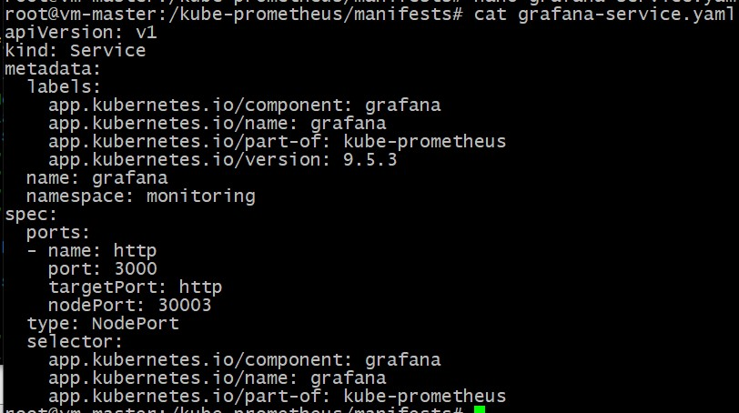


Отключим в `grafana-networkPolicy.yaml` настройки ingress:

```
## grafana-networkPolicy.yaml

apiVersion: networking.k8s.io/v1
kind: NetworkPolicy
metadata:
  labels:
    app.kubernetes.io/component: grafana
    app.kubernetes.io/name: grafana
    app.kubernetes.io/part-of: kube-prometheus
    app.kubernetes.io/version: 9.3.2
  name: grafana
  namespace: monitoring
spec:
  egress:
  - {}
  ingress:
  - {}
#  - from:
#    - podSelector:
#        matchLabels:
#          app.kubernetes.io/name: prometheus
#    ports:
#    - port: 3000
#      protocol: TCP
  podSelector:
    matchLabels:
      app.kubernetes.io/component: grafana
      app.kubernetes.io/name: grafana
      app.kubernetes.io/part-of: kube-prometheus
  policyTypes:
  - Egress
  - Ingress
```
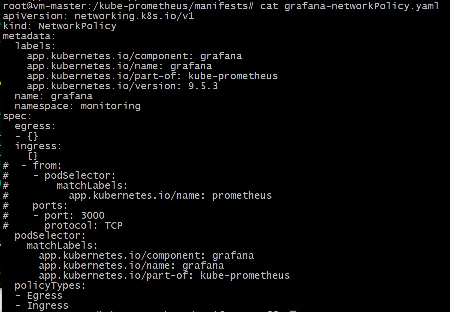


2. Создадим пространство имен и `CRD`:

---
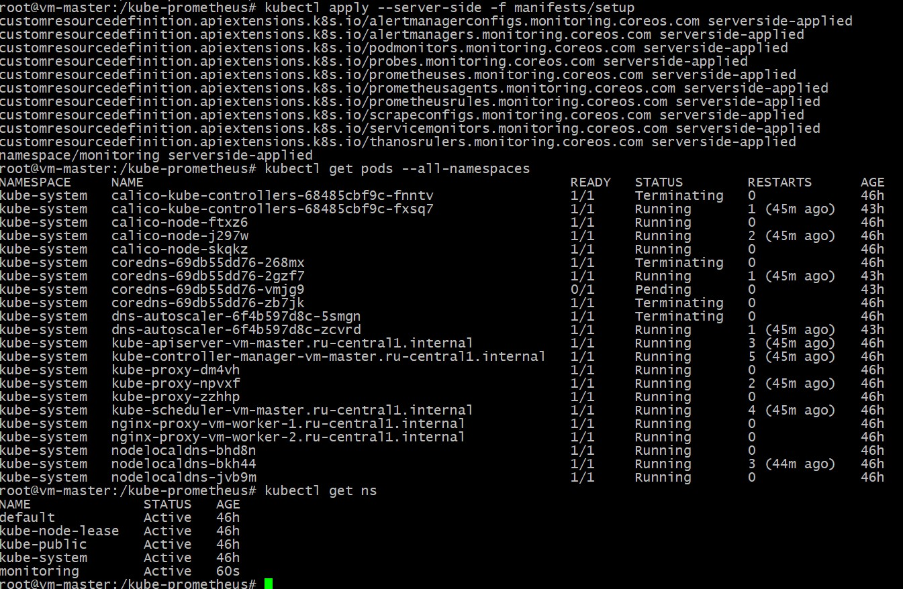
---
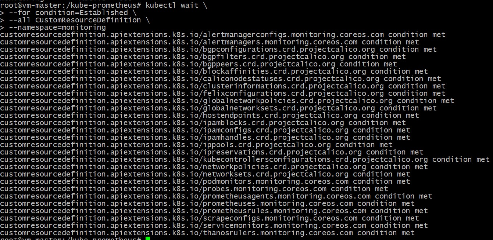
---

3. Проверяем созданные ресурсы:

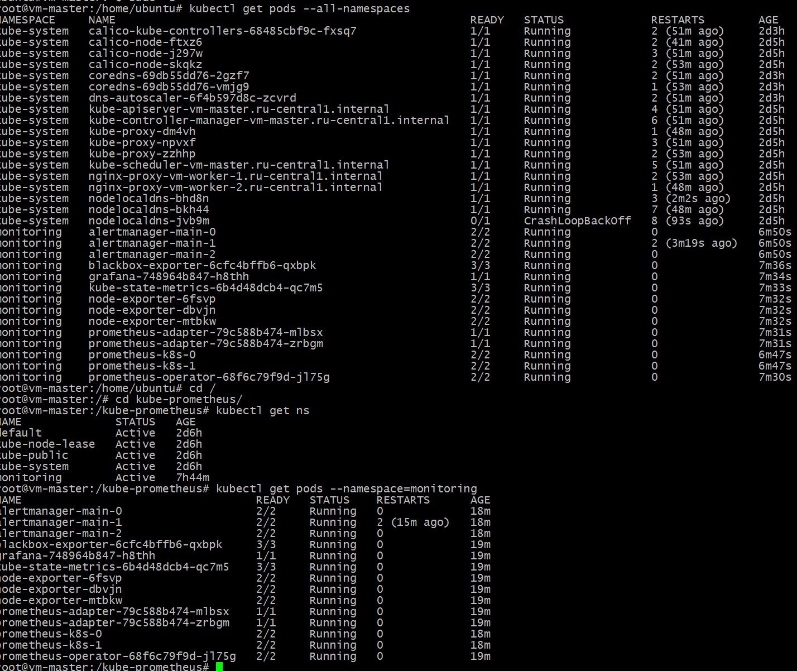

4. Проверяем работу сервса `Grafana`:

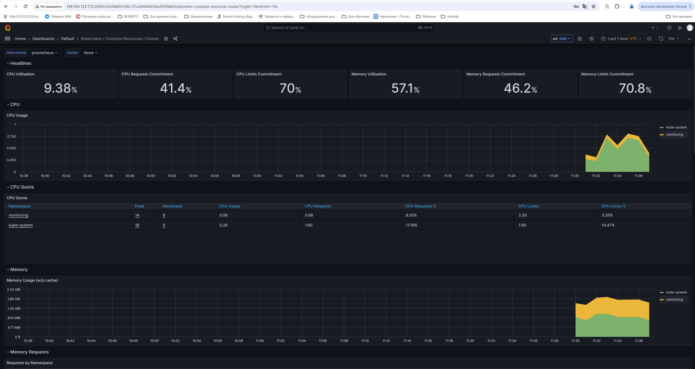

5. Для деплоя тестового приложения, созданного на 3-м этапе используем `Qbec`

Добавим в первоначальный манифест `Ansible`, который использовали для предварительной настройки ВМ кластера установку Qbec.

```
  - name: Install Qbec
    hosts: master
    become: yes
    tasks:

      - name: Create a directory golang
        become_user: root
        ansible.builtin.file:
          path: ~/golang
          state: directory
          mode: '0755'

      - name: Create a directory qbec
        become_user: root
        ansible.builtin.file:
          path: ~/qbec
          state: directory
          mode: '0755'

      - name: Download Golang
        ansible.builtin.get_url:
          url: https://go.dev/dl/go1.19.7.linux-amd64.tar.gz
          dest: /root/golang/go1.19.7.linux-amd64.tar.gz

      - name: Download Qbec
        ansible.builtin.get_url:
          url: https://github.com/splunk/qbec/releases/download/v0.15.2/qbec-linux-amd64.tar.gz
          dest: /root/qbec/qbec-linux-amd64.tar.gz

      - name: Extract Golang
        ansible.builtin.unarchive:
          src: /root/golang/go1.19.7.linux-amd64.tar.gz
          dest: /usr/local
          remote_src: yes

      - name: Extract Qbec
        ansible.builtin.unarchive:
          src: /root/qbec/qbec-linux-amd64.tar.gz
          dest: /usr/local/bin
          remote_src: yes

      - name: Add usr/local/go/bin in $PATH
        become_user: root
        lineinfile:
          path: "~/.bashrc"
          line: "export PATH=$PATH:/usr/local/go/bin"
```

Применяем измененный манифест и проверяем установку необходимого ПО:

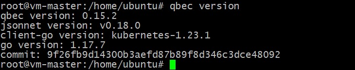

6. Создадим конфигурацию `qbec-stage`:

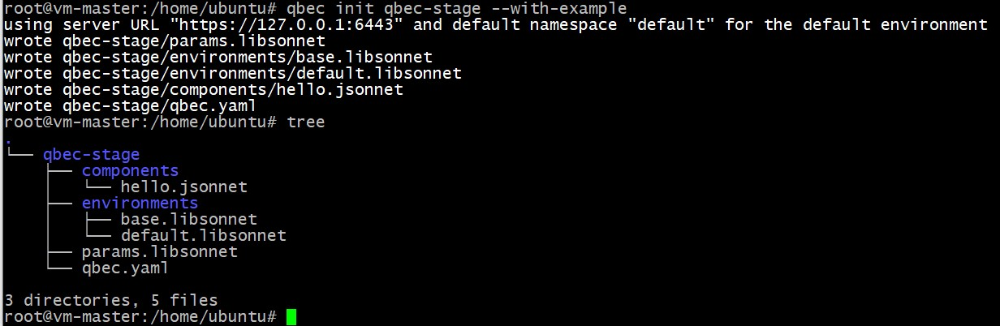

7. Cоздадим окружение: `stage` с явным указанием параметров в файле:

```
## stage.jsonnet

[
  {
    apiVersion: 'apps/v1',
    kind: 'Deployment',
    metadata: {
      name: 'webapp-diplom',
    },
    spec: {
      replicas: 1,
      selector: {
        matchLabels: {
          app: 'webapp'
        },
      },
      template: {
        metadata: {
          labels: {
            app: 'webapp'
          },
        },
        spec: {
          containers: [
            {
              name: 'my-first-registry',
              image: 'cr.yandex/crpmh7guhbh8fj5qs00k/komlev_webapp',
              imagePullPolicy: 'Always'
            },
          ],
        },
      },
    },
  },
]

```

Создадим  `namespace` qbec в кластере `Kubernetes`:

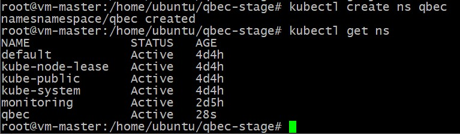

Изменим файл `qbec.yaml` добавим созданные ранее `namespace`:

```
## qbec.yaml

apiVersion: qbec.io/v1alpha1
kind: App
metadata:
  name: qbec-stage
spec:
  environments:
    stage:
      defaultNamespace: qbec
      server: https://127.0.0.1:6443
  vars: {}
```


8. Проверим созданные файлы на валидацию и развернем окружение:

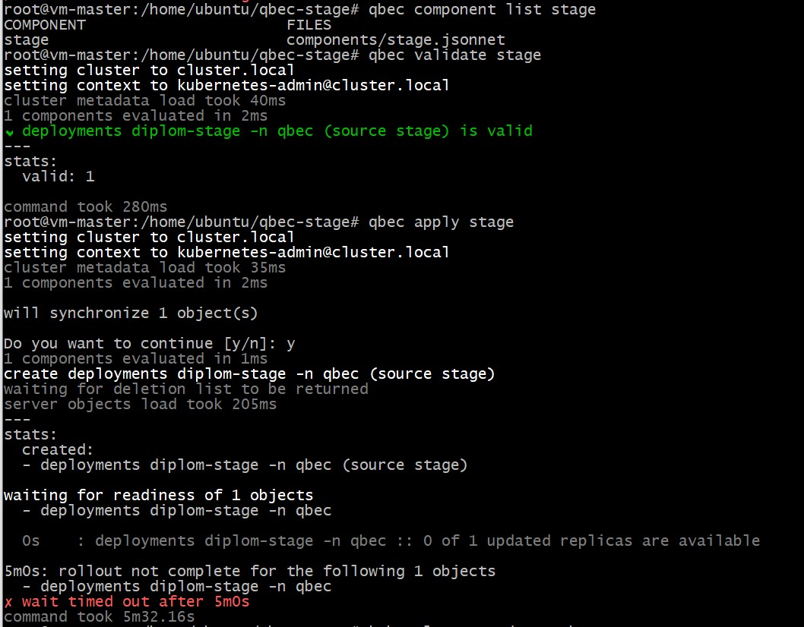

Результат выполнения:

